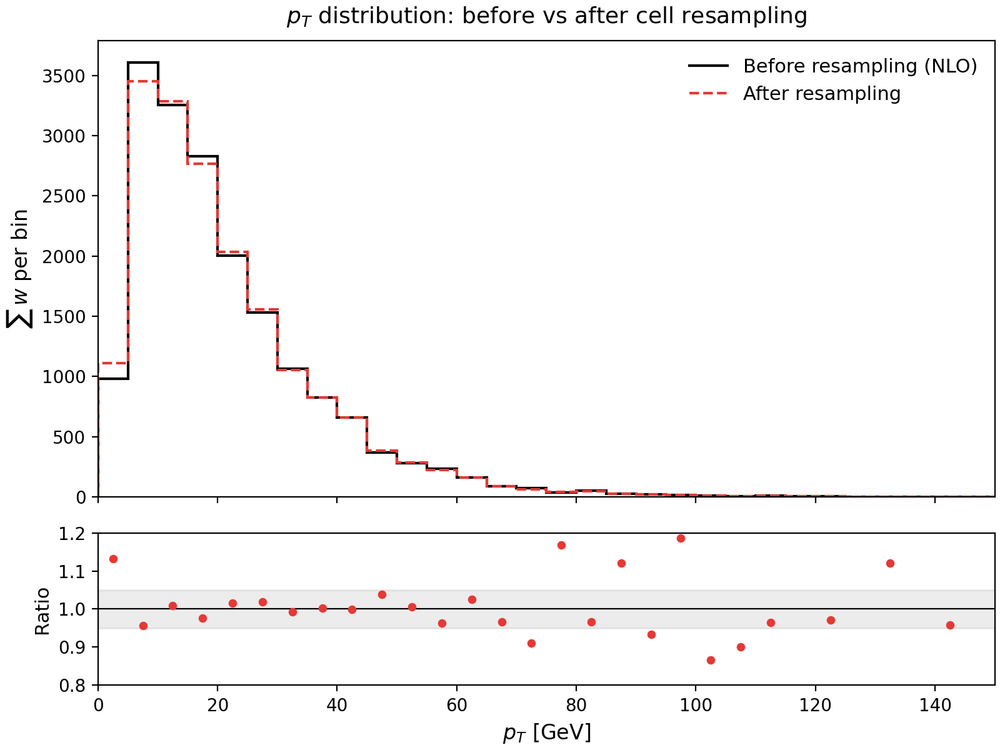
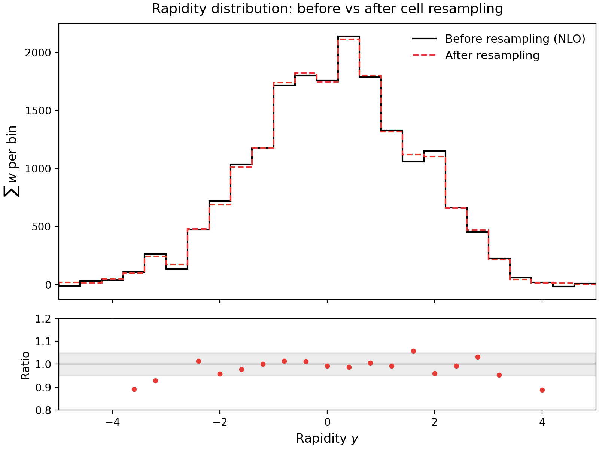

# Negative Weight Mitigation with Cell Resampling

GSoC 2026 Qualification Task for the Negative Weight Mitigation with Cell Resampling project (CERN-HSF).

Implements the cell resampling algorithm from [arXiv:2109.07851](https://arxiv.org/abs/2109.07851) on toy NLO datasets to eliminate negative event weights while preserving physical distributions.

## How to Run

**Requirements:** A C++17 compiler (g++ or clang++) and Python 3 with numpy and matplotlib.

**Step 0: Clone the repo and installing the dependencies**
```bash
git clone https://github.com/harz05/gsoc-mcfm-task.git
cd gsoc-mcfm-task
```

```bash
pip install numpy matplotlib
```

**Step 1: Born Projection** (combines virtual + real events into a single dataset)

```bash
g++ -std=c++17 -O2 -Wall -Wextra -o born_projection born_projection.cpp
./born_projection data/virtual_events.csv data/real_events.csv
```

This reads both CSVs, applies the Born projection to the real events, and writes `combined_before.csv` (4500 events).

**Step 2: Cell Resampling** (eliminates all negative weights)

```bash
g++ -std=c++17 -O2 -Wall -Wextra -o cell_resampling cell_resampling.cpp
./cell_resampling combined_before.csv combined_after.csv
```

Reads `combined_before.csv`, runs the resampling algorithm, and writes `combined_after.csv` with all weights non-negative.

**Step 3: Verification Plots**

```bash
python3 plot_distributions.py combined_before.csv combined_after.csv
```

Generates `pt_distribution.png` and `y_distribution.png`.

## Repository Structure

```
.
├── born_projection.cpp      Task 1: Born projection and dataset combination
├── cell_resampling.cpp      Task 2: Cell resampling algorithm
├── plot_distributions.py    Task 3: Verification histogram plots
├── data/
│   ├── virtual_events.csv   1500 virtual (n-body) events, all negative weight
│   └── real_events.csv      3000 real emission (n+1 body) events
├── combined_before.csv      Combined dataset before resampling (4500 events)
├── combined_after.csv       Combined dataset after resampling (all weights >= 0)
├── pt_distribution.png      pT distribution comparison plot
├── y_distribution.png       Rapidity distribution comparison plot
└── README.md
```

## Task 1: Born Projection

**File:** `born_projection.cpp`

Virtual events are already in Born (n-body) kinematics with columns `pt, y, weight`. They pass through unchanged.

Real emission events have an extra radiated gluon and live in (n+1)-body phase space with columns `pt_real, y_real, z_gluon, weight`. To bring them into the same coordinate space as virtual events, we apply the Born projection:

```
pt = pt_real + z_gluon
y  = y_real
```

The `z_gluon` variable represents the transverse momentum carried away by the radiated gluon. Adding it back recovers the pre-radiation kinematics of the Born system.

After projection, both datasets are merged into a single list of 4500 events defined by `(pt, y, weight)`. The key function here is `read_real_projected()`, which applies the projection inline while parsing the CSV.

**Output summary:**
| Dataset | Events | Negative | Sum(w) |
|---------|--------|----------|--------|
| Virtual | 1500 | 1500 | -7560.3 |
| Real (projected) | 3000 | 0 | +25684.3 |
| Combined | 4500 | 1500 | +18124.0 |

## Task 2: Cell Resampling Algorithm

**File:** `cell_resampling.cpp`

The goal is to eliminate all negative event weights without changing the physical distributions. The algorithm groups nearby events into cells and redistributes their weights so that every weight becomes non-negative while the total weight of each cell is conserved.

The core idea is if a group of kinematically close events has a positive total weight, we can freely redistribute the individual weights among them. A real detector with finite resolution cannot distinguish between events that are close enough in phase space, thus the predicted observables remain unchanged.

### Algorithm Steps

**1. Seed selection**

We collect all events with negative weight as potential seeds, then sort them by weight (most negative first). This ordering comes from Appendix A of [arXiv:2109.07851](https://arxiv.org/abs/2109.07851), which compares three seed selection strategies. The "most negative first" approach processes the seeds that need the largest cells while the surrounding positive-weight events are still at full strength. This leads to smaller cells on average, which means less smearing of the distributions.

In our implementation this is just a `std::sort` on the seed indices.

**2. Cell growing**

For each seed, we grow a cell by repeatedly finding the nearest neighbor of the seed (using the scaled distance metric) that is not already in the current cell. We keep adding neighbors until the total weight of the cell becomes non-negative.

The distance is always measured from the seed, not from the last-added event. The cell is conceptually a sphere centered on the seed (Section 2 of the paper: "a small solid sphere in phase space that is centred around said event").

One important however to note from [arXiv:2303.15246](https://arxiv.org/abs/2303.15246) is that **"an event can be part of several cells, but will only be chosen as a cell seed at most once."** So events that were already resampled in a previous cell can be pulled into new cells using their updated weights. If a seed's weight has already become non-negative from an earlier cell's redistribution, we skip it.

In our run, 450 out of 1500 seeds were skipped this way because earlier cells had already turned their weights positive.

**3. Weight redistribution**

Once a cell has non-negative total weight, we apply Equation 2.2 from [arXiv:2109.07851](https://arxiv.org/abs/2109.07851):

```
w'_i = (|w_i| / Σ|w_j|) * Σw_j
```

where both sums run over all events j in the cell. This formula guarantees three things:
- Every new weight is non-negative (product of non-negative terms)
- The total weight of the cell is conserved (the fractions `|w_i|/Σ|w_j|` sum to 1)
- Events with larger original magnitude keep proportionally larger weights

### Distance Metric

The distance between two events in (pt, y) space is:

```
d(i,j) = sqrt((pt_i - pt_j)^2 + 100 * (y_i - y_j)^2)
```

The factor 100 is a scaling parameter that puts both coordinates on comparable numerical footing. This is the 2D analog of the tau parameter in Equation 2.11 of [arXiv:2109.07851](https://arxiv.org/abs/2109.07851), which controls the relative weighting of different momentum components. See the discussion question below for a detailed explanation of why this scaling is necessary.

### Nearest-Neighbor Search: k-d Tree

The naive approach to finding nearest neighbors is to scan all N events for each query, giving O(N) per query and O(N^2) overall. However on reading [arXiv:2303.15246](https://arxiv.org/abs/2303.15246) it became very clear that this approach becomes infeasible for large samples and introduces vantage-point trees for acceleration.

To tackle this issue i've used **a 2D k-d tree, which provides equivalent O(log N)** average query time in two-dimensional phase space. The k-d tree works by recursively partitioning the (pt, y) plane along alternating axes using the median value at each level. This creates a balanced binary tree where nearest-neighbor queries can prune entire subtrees that cannot contain a closer point than the current best.

The k-d tree implementation supports an exclusion set for queries, which is needed for the cell growing loop. When growing a cell, we need "the nearest neighbor not already in this cell." Excluded nodes are skipped as candidates but the tree's split planes are still used for pruning, which is correct because the split planes are a geometric property of the data partition.

## Computational Complexity

Let N be the total number of events, S the number of negative-weight seeds, and k the average cell size (number of events per cell).

**k-d tree construction:** The tree is built once before resampling. At each level of the tree, we find the median along one axis using `std::nth_element`, which runs in O(N). The tree has O(log N) levels, giving a total build time of **O(N log N)**.

**Single nearest-neighbor query:** The k-d tree search visits one node per level in the best case, giving O(log N). In the worst case (highly unbalanced queries or adversarial data), it degrades to O(N), but this does not occur in practice for our uniformly distributed 2D data. Average case: **O(log N)**.

**Cell construction for one seed:** Growing a cell requires k nearest-neighbor queries (one per event added to the cell). Each query also needs an exclusion set lookup, which is O(1) amortized for `std::unordered_set`. Total per cell: **O(k log N)**.

**Full resampling:** We process S seeds, but some are skipped (their weight already became non-negative). Let S' <= S be the number of cells actually formed. Total: **O(S' * k * log N)**.

**Putting it together:**

For our dataset: N = 4500, S = 1500, S' = 1050, k_avg = 2.96.

In the worst case, S and S'*k are both O(N) (every event is a seed and every cell pulls in a constant fraction of events), which gives **O(N^2 log N)**. But in practice, k is small and roughly constant (around 3 in our run, and it does not grow with N because larger samples have higher event density, so cells need fewer neighbors to accumulate enough positive weight). This makes the practical/average complexity to be **O(N log N)**.

For comparison, the brute-force approach without a k-d tree would be O(N^2), which is what Section 2.2 of [arXiv:2303.15246](https://arxiv.org/abs/2303.15246) identifies as the bottleneck for large samples.

## Discussion Question

> Why is the scaling factor of 100 necessary? What would happen to the physical distributions if we used standard Euclidean distance without scaling, and how does the limit of infinite generated events affect this choice?

### Why scaling is necessary

The two coordinates pt and y have very different numerical ranges. In our dataset, pt spans roughly 0 to 286 GeV while y spans roughly -5 to +5. Without scaling, the Euclidean distance is completely dominated by pt differences.

Consider two pairs of events:
- Pair A: same rapidity, pt differs by 10 GeV. Distance = 10.
- Pair B: same pt, rapidity differs by 2 (a large physical difference). Distance = 2.

The algorithm would consider Pair B "closer" and preferentially group events that differ widely in rapidity. Cells would be elongated along the y axis, spanning a wide rapidity range while being narrow in pt.

### What happens without scaling

When weights are redistributed within such elongated cells, weight moves between events that would fall in different rapidity bins. This distorts the rapidity distribution. Specifically, the distribution would get smeared. Peaks would be flattened and tails would be inflated, because weight from the central (high-density) region migrates to the edges.

The pt distribution would be better preserved because cells would be narrow in that direction. So the damage is asymmetric i.e. the observable whose coordinate has the smaller numerical range gets smeared more.

**The scaling factor corrects this by making the distance metric "isotropic" in terms of physical significance.** The factor 100 is roughly (pt_range / y_range)^2 = (280/10)^2 ≈ 784, so 100 is the right order of magnitude. This is analogous to the tau parameter in Equation 2.11 of [arXiv:2109.07851](https://arxiv.org/abs/2109.07851), which rescales the transverse momentum component of the distance function.

### The infinite-events limit

In the limit of infinite generated events, the event density becomes arbitrarily high everywhere in phase space. Cells shrink to infinitesimal size regardless of their shape. Even highly elongated cells (from an unscaled metric) would become so small that all events within a cell fall in the same histogram bin in every direction.

Formally, as N approaches infinity, the cell radius R approaches 0. When R is 0, no weight migrates between bins, and the scaling factor becomes irrelevant.

But we never have infinite events. With finite statistics, the scaling factor controls how the finite cell size is distributed across dimensions. A good scaling factor ensures that the unavoidable smearing is spread evenly across all observables rather than concentrated in one.

## Verification Results

After resampling, all 1500 negative weights were eliminated with total weight conserved to machine precision (delta < 10^-11).

| Metric | Before | After |
|--------|--------|-------|
| Negative events | 1500 | 0 |
| Sum(w) | 18124.0 | 18124.0 |
| r- (neg fraction) | 0.227 | 0.000 |
| N(r-)/N(0) (inflation) | 3.36 | 1.00 |
| Cells formed | | 1050 |
| Avg cell size | | 3.0 events |
| Median cell radius | | 0.63 |

The inflation factor dropping from 3.36 to 1.00 means the resampled sample has the same statistical power as an ideal sample with no negative weights. Before resampling, you would have needed 3.36x more events to achieve the same precision.

### pT Distribution



### Rapidity Distribution



Both distributions are well preserved after resampling. The ratio panels show that bins with significant statistics (the bulk of the distribution) agree within a few percent. Bins in the tails (high pt, large |y|) show larger percentage deviations because they contain very few events, so even a single cell boundary crossing a bin edge causes a noticeable fractional change. This is expected with only 4500 events and would improve systematically with larger samples.

## References

1. J. R. Andersen, A. Maier, "Unbiased Elimination of Negative Weights in Monte Carlo Samples," [arXiv:2109.07851](https://arxiv.org/abs/2109.07851)
2. J. R. Andersen, A. Maier, D. Maitre, "Efficient negative-weight elimination in large high-multiplicity Monte Carlo event samples," [arXiv:2303.15246](https://arxiv.org/abs/2303.15246)
